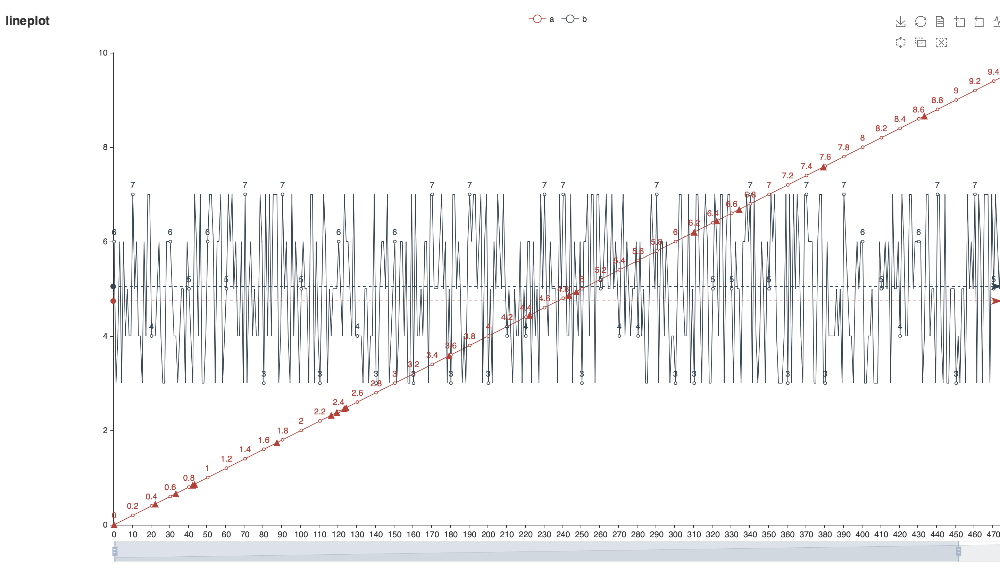

# prda

## Prda contains packages for data processing, analysis and visualization.

Prda ultimate goal is to **fill the “last mile” between analysts and packages**. During my research practice, I have felt how “learning a package before utilizing” can be time-consuming and exhausting. The resulted inefficiency leads to the creation of *prda*.

## How to Use
```
pip install prda
```

See details in: https://pypi.org/project/prda/

You are welcome to clone *prda* for personal use (**to use, simply add the folder to your system path**) and **pull request** of your modification is super!! encouraged.

----


~~To utilize prda, you only need to be familiar with `pandas` as most inputs is `pd.DataFrame`.~~

Currently with the help of **ChatGPT**, you can just tailor the input of demonstration code below to your data. And you don't need to be familiar with pandas or even python.


## Examples

```python
import prda
import pandas as pd
import numpy as np
df = pd.DataFrame(data=np.array([np.arange(100) for i in range(5)]).T,columns=['a', 'b', 'c', 'd', 'e'])
prda.graphic.scatter_3d_html(df, x='a', y='b', z='c', color_hue='d', size_hue='e', title='demo_3d_scatter', filepath='demo_3d_scatter.html')
```

the above code will provide an interactive html figure that look like this:


[demo_3d_scatter.html](/demo/demo_3d_scatter.html)

----

```python
import prda
import pandas as pd
import numpy as np
datalen = 500
indices = np.arange(datalen)
col_a = np.arange(0, 10, 10/datalen)
col_b = np.random.randint(3, 8, datalen)
data = np.array([indices, col_a, col_b]).T
df = pd.DataFrame(data=data, columns=['idx', 'a', 'b'])

# draw
import random
point_markers = {
    'a': [(indices[i], col_a[i]) for i in random.sample(list(indices), 20)]
}
prda.graphic.lineplot_html(df, x='idx', y=['a', 'b'], markpoints=point_markers, filepath='demo_lineplot.html')
```
|     |  idx  |   a  |   b  |
|:---:|:-----:|:----:|:----:|
|  0  |  0.0  | 0.00 |  6.0 |
|  1  |  1.0  | 0.02 | 3.0 |
|  2  |  2.0  | 0.04 | 4.0 |
| ... |  ...  |  ... |  ... |
| 498 | 498.0 | 9.96 | 6.0 |
| 499 | 499.0 | 9.98 | 5.0 |

And code with the above DataFrame will draw anther plot look like this:



[demo_lineplot.html](/demo/demo_lineplot.html)

Although the current *prda* is far from completion, let along perfection. It is under improvement regularly.

----
## Updates
### 2023.5.3 Major Updates
Add several easy-to-use functions, including `prep::`pca, select_continuous_variables, handle_missing_data, apply_linear_func(row-wisely), and `ml::`match_clusters, evaluate_param_combinations(optimal parameters searching, with base class::sklearn.base.BaseEstimator), etc.